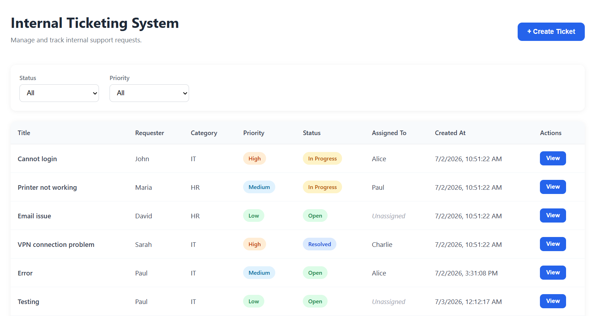
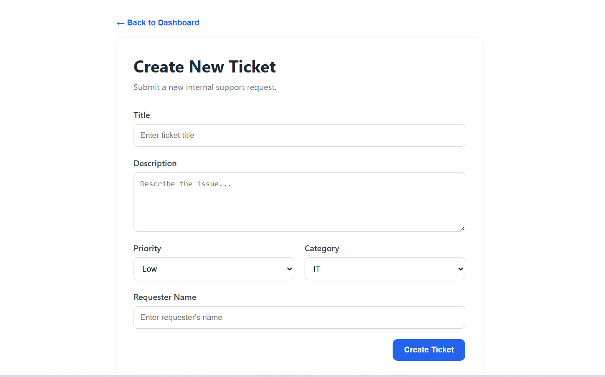
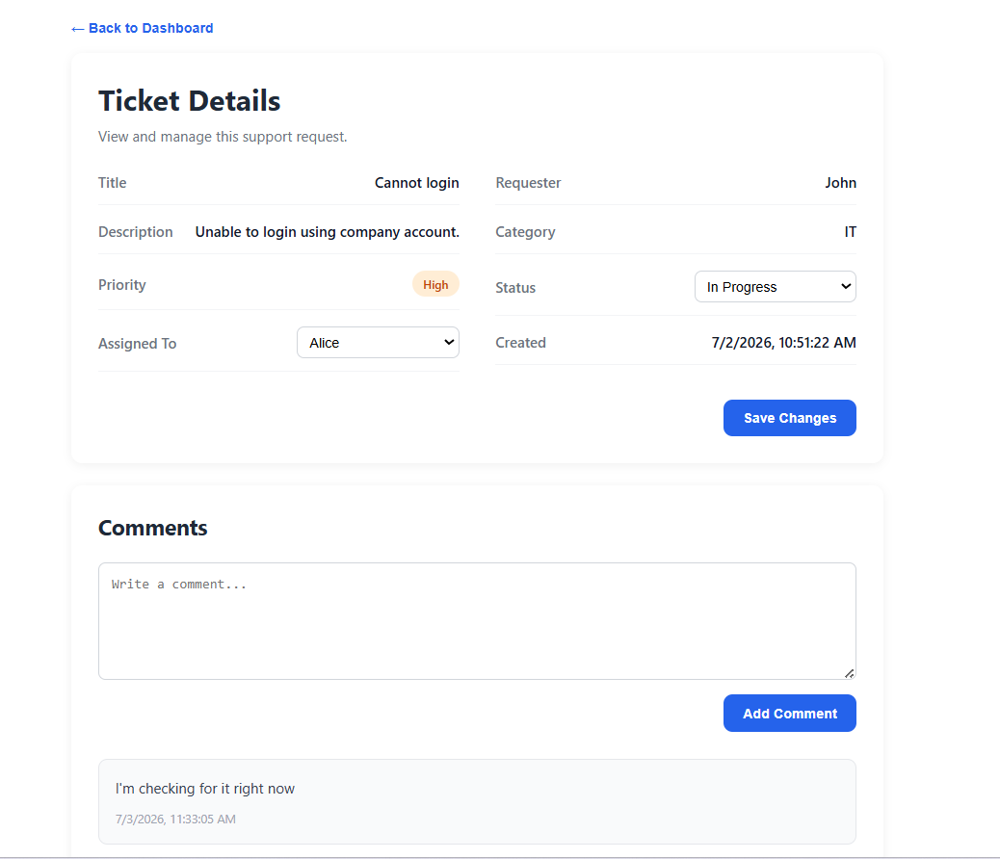

# Internal Ticketing System (MVP)

## Overview

This project is a full-stack Internal Ticketing System developed as part of a technical assessment.

The application allows users to create support tickets, assign tickets to agents, update ticket status, filter tickets, and collaborate through comments. The goal was to build a working MVP that demonstrates both backend API development and frontend application development using a modern technology stack.

---

# Technology Stack

## Backend

- ASP.NET Core Web API
- Entity Framework Core
- SQL Server

**Why I chose it**

I chose ASP.NET Core Web API because it provides a clean architecture for building RESTful APIs and integrates well with Entity Framework Core for database operations. SQL Server was selected because it works seamlessly with EF Core and is well suited for relational data such as tickets and comments.

---

## Frontend

- React
- Vite
- Axios
- React Router
- SCSS

**Why I chose it**

React provides a component-based architecture that keeps the UI organized and reusable. Vite offers a fast development experience with quick startup and hot module replacement. Axios simplifies communication with the backend API, while SCSS allows better organization and customization of styles compared to writing plain CSS.

---

# Features Implemented

## Dashboard

- View all tickets
- Filter by Status
- Filter by Priority
- View ticket details

## Ticket Management

- Create a new ticket
- Update ticket status
- Assign ticket to an agent

## Comments

- Add comments to a ticket
- View ticket comments

## Validation

- Client-side validation for ticket creation
- Server-side validation through ASP.NET Core model validation

## User Interface

- Dashboard with modern card layout
- Responsive Create Ticket page
- Ticket Detail page with editable fields
- Consistent SCSS styling across the application

---

# Features Not Implemented

The following features were intentionally left out because they were outside the scope of the MVP:

- User authentication
- Role-based authorization
- User management
- Email notifications
- File attachments
- Activity log / ticket history
- Search functionality
- Pagination

---

# Setup Instructions

## Prerequisites

Install the following:

- .NET 8 SDK
- Node.js
- SQL Server
- Visual Studio 2022 (or Visual Studio Code)

---

# Backend Setup

## 1. Open the backend project

Open the Backend solution in Visual Studio.

---

## 2. Configure the database

Open

```
Backend/appsettings.json
```

Update the connection string to match your SQL Server instance.

Example:

```json
"ConnectionStrings": {
  "DefaultConnection": "Server=YOUR_SERVER;Database=TicketingSystem;Trusted_Connection=True;TrustServerCertificate=True;"
}
```

---

## 3. Database Setup

This project uses SQL Server.

Two database options are provided:

### Option 1 (Recommended): SQL Script

Run the provided SQL script:

```
Database/TicketingDB.sql
```

This will create the required database schema.

---

### Option 2: Database Backup

Restore the provided SQL Server backup:

```
Database/TicketingDB.bak
```

using SQL Server Management Studio.

---

After creating or restoring the database, update the connection string in:

```
Backend/appsettings.json
```

---

## 4. Run the backend

Start the ASP.NET Core API.

The API should be available at:

```
https://localhost:7170
```

Swagger:

```
https://localhost:7170/swagger
```

---

# Frontend Setup

Navigate to:

```
Frontend/ticketing-client
```

Install dependencies:

```
npm install
```

---

## Configure the API URL

The frontend is configured to communicate with the backend using the environment variable defined in:

```
Frontend/ticketing-client/.env
```

The file should contain:

```
VITE_API_URL=https://localhost:7170/api
```

> If the backend is running on a different port, update the value of `VITE_API_URL` to match your local backend URL.

---

## Run the frontend

```
npm run dev
```

Open:

```
http://localhost:5173
```

---

# API Endpoints

## Ticket

| Method | Endpoint | Description |
|---------|----------|-------------|
| GET | /api/Ticket | Get all tickets |
| GET | /api/Ticket/{id} | Get ticket details |
| POST | /api/Ticket | Create ticket |
| PUT | /api/Ticket/{id} | Update ticket |

---

## Comment

| Method | Endpoint | Description |
|---------|----------|-------------|
| GET | /api/Comment/{ticketId} | Get comments |
| POST | /api/Comment | Add comment |

---

# Known Limitations

This project is intentionally an MVP and has a few known limitations:

- Agents are currently hardcoded in the frontend instead of coming from a Users table.
- Comments do not record the author of the comment.
- No authentication or authorization has been implemented.
- Dashboard does not include search or pagination.
- Activity log/history is not implemented.
- File uploads are not supported.

These limitations were accepted to keep the project within the scope of the assessment.

---

# What I Would Do Next

If I had another day to continue development, I would prioritize the following improvements:

1. Implement authentication and role-based authorization.
2. Replace hardcoded agents with a Users table.
3. Add an activity log to track ticket history.
4. Add search and pagination on the dashboard.
5. Support file attachments for tickets.

---

# Project Structure

```
TicketingSystem
│
├── Backend
│   ├── Controllers
│   ├── Data
│   ├── DTOs
│   ├── Models
│   ├── Services
│   ├── Program.cs
│   └── appsettings.json
│
├── Frontend
│   └── ticketing-client
│       └── src
│           ├── api
│           ├── pages
│           │   ├── CreateTicket
│           │   ├── Dashboard
│           │   └── TicketDetail
│           ├── routes
│           └── services
│
└── Database


```

---

# Screenshots

- Dashboard
    
- Create Ticket
    
- Ticket Detail
    
---

